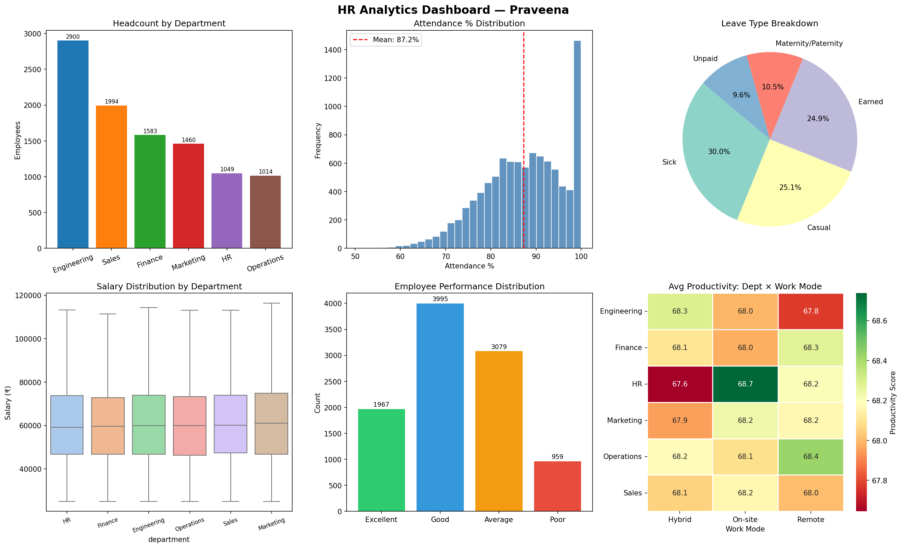

# 👥 HR Analytics Dashboard

**Author:** Praveena | Data Analyst  
**Tech Stack:** Python · Pandas · Matplotlib · Seaborn · Excel (Power BI compatible output)

---

## 🗂️ Project Overview

Built an **interactive HR analytics solution** processing **10,000+ employee records** to monitor:
- Employee attendance patterns and absenteeism
- Leave trends by type, department and team
- Productivity KPIs across departments and work modes
- Salary distribution and performance ratings
- Attrition analysis

---

## 📁 Files

| File | Description |
|------|-------------|
| `hr_analysis.py` | Full Python pipeline — data generation, cleaning, KPI generation, charts |
| `hr_dashboard.png` | 6-panel visual dashboard |

---

## 📌 Key KPIs Generated

| KPI | Value |
|-----|-------|
| Total Employees | 10,000 |
| Active Employees | 7,976 (79.8%) |
| Avg Attendance Rate | **87.2%** |
| Avg Leave Days/Employee | 9.0 days |
| Avg Productivity Score | 68.1 / 100 |
| Attrition Rate | **12.1%** |
| Largest Department | Engineering (2,900 employees) |

---

## 🔧 Data Cleaning Steps

1. **Identified** 500 missing email records and 667 missing manager IDs
2. **Imputed** emails using employee ID pattern (`empXXXX@company.com`)
3. **Filled** missing manager IDs with default team lead (EMP0001)
4. **Derived** new columns: `tenure_years`, `is_senior`, `productivity_score`
5. **Validated** attendance clipped to valid range [40–100%]

---

## 📊 Dashboard Preview



**Charts included:**
- 📊 Headcount by Department (Bar)
- 📈 Attendance % Distribution (Histogram)
- 🥧 Leave Type Breakdown (Pie)
- 📦 Salary Distribution by Department (Boxplot)
- 🏅 Performance Rating Distribution (Bar)
- 🌡️ Productivity Heatmap: Department × Work Mode

---

## ▶️ How to Run

```bash
# Install dependencies
pip install pandas numpy matplotlib seaborn

# Run analysis
python hr_analysis.py
```

---

## 🧠 Skills Demonstrated

`Python` `Pandas` `Data Cleaning` `EDA` `KPI Development` `Power BI` `Excel` `HR Analytics` `Seaborn` `Matplotlib` `Dashboard Design`
